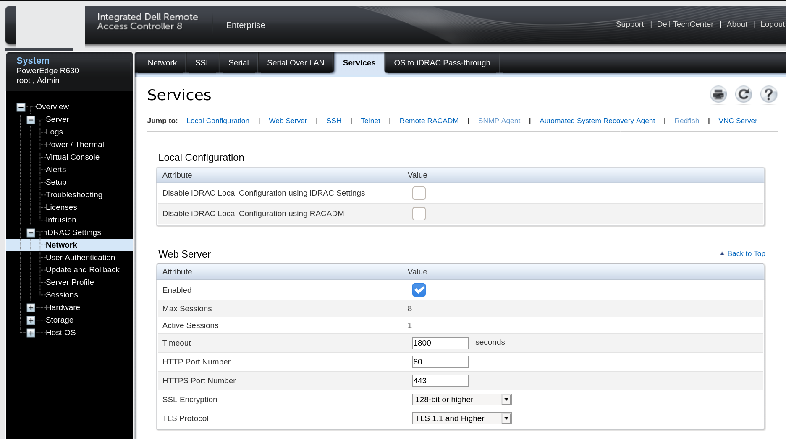
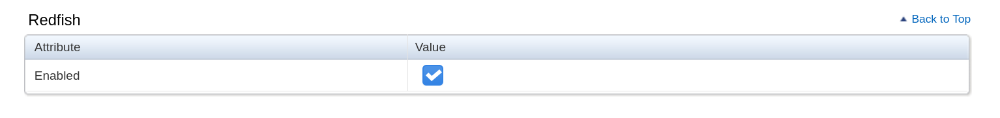
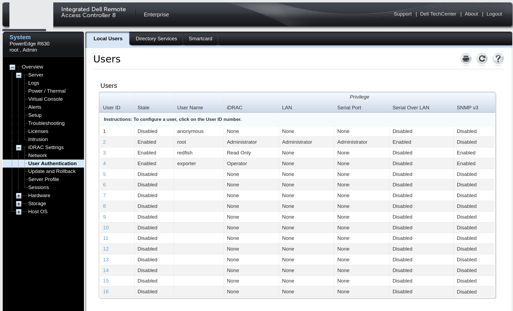
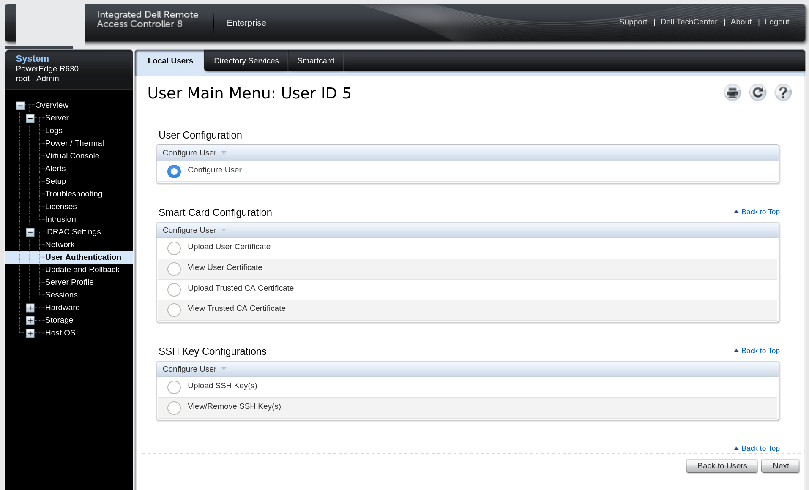
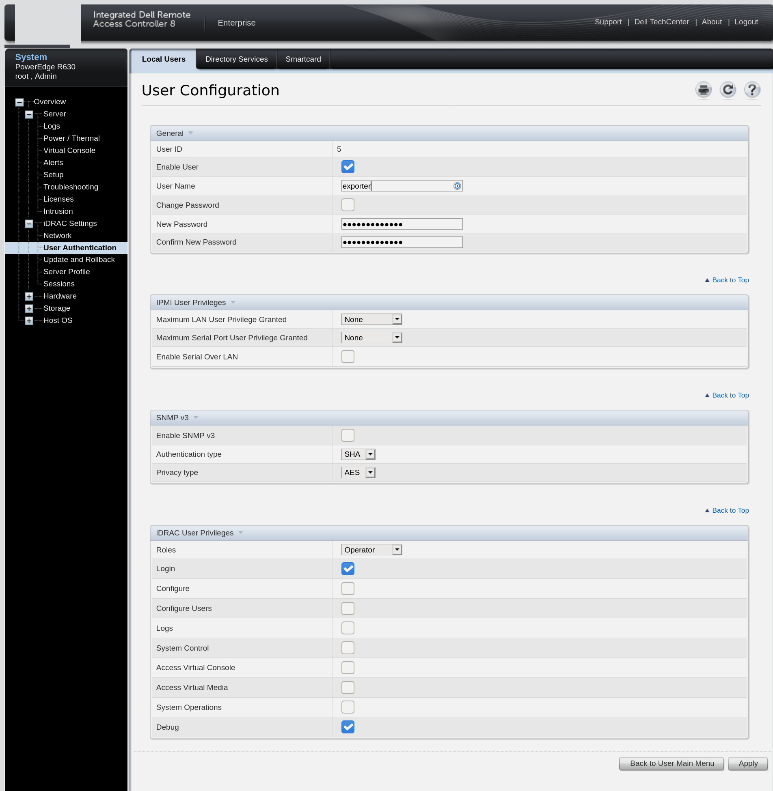

IDRAC 8 user creation
---

First connect to IDRAC, and go to : `iDRAC Setting` => `Network` => `Services` => 'Redfish'

Then Check `Enabled` check box in Redfish

Go to `iDRAC Setting` => `User Authentication` => `Local Users`, click on an available user ID (5 here)

Check `Configure User` then click Next

Check `Enable User`, fill `User Name`, passwords, Check `Login` then Check `Debug`, click `Apply` and user will be created

